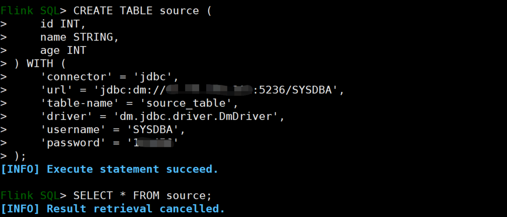

# flink-connector-jdbc-dameng
# 介绍
项目为实现flink通过flink-connector-jdbc的方式连接DM数据库进行数据的增删改查功能。

# 编译项目
拉取代码以后直接mvn编译即可
```
mvn clean package
```

# Flink连接达梦并查询
1. 自己编译包或下载适配包 [https://github.com/gaoyuan98/flink-connector-jdbc-dameng/releases](https://github.com/gaoyuan98/flink-connector-jdbc-dameng/releases)
2. 截止发文v3.3版本,flink官方还未正式发版，所以大概率是用这个版本：[flink-connector-jdbc-dameng_20250331_(适用于v3.2及以下版本)](https://github.com/gaoyuan98/flink-connector-jdbc-dameng/releases/tag/flink-connector-jdbc-dameng_20250331)
   如项目中已经有flink-connector-jdbc的包，那么只需要使用DmJdbcDriver8.jar跟flink-connector-jdbc-dameng-1.0.jar的驱动包即可。
   如项目中没有flink-connector-jdbc的包，就把这三个包全部放到lib下。
```
[root@localhost lib]# cd /data/flink_soft/flink-1.16.1/lib
[root@localhost lib]# ll
total 204020
-rw-r--r--. 1 root root   1615303 Jan 17 00:30 DmJdbcDriver8.jar
-rwxrwxrwx. 1 root root    198857 Jan 19  2023 flink-cep-1.16.1.jar
-rwxrwxrwx. 1 root root    516144 Jan 19  2023 flink-connector-files-1.16.1.jar
-rw-r--r--. 1 root root    277945 Mar 28 23:46 flink-connector-jdbc-3.1-SNAPSHOT.jar
-rw-r--r--. 1 root root     13458 Mar 29 00:13 flink-connector-jdbc-dameng-1.0-SNAPSHOT.jar
-rwxrwxrwx. 1 root root    102470 Jan 19  2023 flink-csv-1.16.1.jar
-rwxrwxrwx. 1 root root 117107159 Jan 19  2023 flink-dist-1.16.1.jar
-rwxrwxrwx. 1 root root    180248 Jan 19  2023 flink-json-1.16.1.jar
-rwxrwxrwx. 1 root root  21052640 Jan 19  2023 flink-scala_2.12-1.16.1.jar
-rwxrwxrwx. 1 root root  10737871 Jan 13  2023 flink-shaded-zookeeper-3.5.9.jar
-rwxrwxrwx. 1 root root  15367504 Jan 19  2023 flink-table-api-java-uber-1.16.1.jar
-rwxrwxrwx. 1 root root  36249667 Jan 19  2023 flink-table-planner-loader-1.16.1.jar
-rwxrwxrwx. 1 root root   3133690 Jan 19  2023 flink-table-runtime-1.16.1.jar
-rwxrwxrwx. 1 root root    208006 Jan 13  2023 log4j-1.2-api-2.17.1.jar
-rwxrwxrwx. 1 root root    301872 Jan 13  2023 log4j-api-2.17.1.jar
-rwxrwxrwx. 1 root root   1790452 Jan 13  2023 log4j-core-2.17.1.jar
-rwxrwxrwx. 1 root root     24279 Jan 13  2023 log4j-slf4j-impl-2.17.1.jar
```
3. 重启flink
```
[root@localhost flink-1.16.1]# cd /data/flink_soft/flink-1.16.1
[root@localhost flink-1.16.1]# ./bin/stop-cluster.sh
[root@localhost flink-1.16.1]# ./bin/start-cluster.sh

## 如果报错的话查看这个日志
tail -f $FLINK_HOME/log/flink-*-taskexecutor-*.log
```
4. 在DM数据库创建对应的表
```sql
## 在达梦数据库上创建表数据
CREATE TABLE source_table (
    id INT PRIMARY KEY,
    name VARCHAR(50),
    age INT
);
INSERT INTO source_table (id, name, age) VALUES (1, 'Alice', 30);
INSERT INTO source_table (id, name, age) VALUES (2, 'Bob', 25);
INSERT INTO source_table (id, name, age) VALUES (3, 'Charlie', 40);
COMMIT;
```
5. flink创建表并查询数据
```sql
[root@localhost lib]# cd /data/flink_soft/flink-1.16.1/
[root@localhost flink-1.16.1]#  ./bin/sql-client.sh embedded

CREATE TABLE source (
    id INT,
    name STRING,
    age INT
) WITH (
    'connector' = 'jdbc',
    'url' = 'jdbc:dm://192.168.127.2:5236/SYSDBA',
    'table-name' = 'source_table',
    'driver' = 'dm.jdbc.driver.DmDriver',
    'username' = 'SYSDBA',
    'password' = 'SYSDBA123'
);


## 在 Flink SQL CLI 中查询数据
SELECT * FROM source;

## 筛选数据，比如 查询年龄大于 30 的用户：
SELECT id, name FROM source WHERE age > 30;

## 插入数据
INSERT INTO source (id, name, age) VALUES (3, '33', 33);
```
<br />

<br />


# 微信公众号
扫码或微信公众号搜索“达梦课代表”分享使用达梦数据库遇到的各类问题及经验
<br />

<br />

